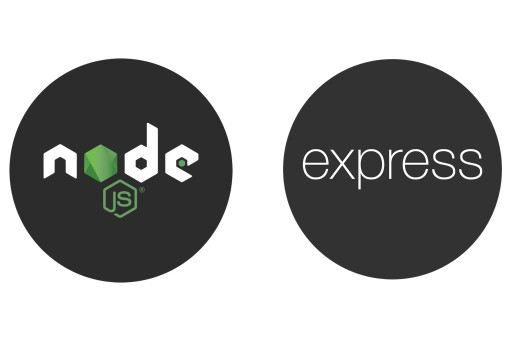

# Toolbox backend challenge



This repository responds to the Toolbox backend challenge. The main technologies being used are:

- Node JS
- Express
- Chai - ChaiHTTP
- Mocha
- Axios
- csv-parser

### Important

- To be able to display this table in the frontend, you must have the [frontend repository running](https://github.com/mdominguez56/toolbox-frontend).

## Installation

To run this project, you will need to execute the following commands:

```bash
nvm use
npm install
```

## Usage

- The backend can be accessed through the endpoint: **/files/data**

```python
# run project
npm start

# run unit test
npm test (In progress...)
```

## API Reference

#### Get all files

```http
  GET /files/data
```

| Parameter  | Type     | Description                                     |
| :--------- | :------- | :---------------------------------------------- |
| `fileName` | `string` | **Optional**. The name of the file to filter by |

## Extra features

- Search function by fileName
